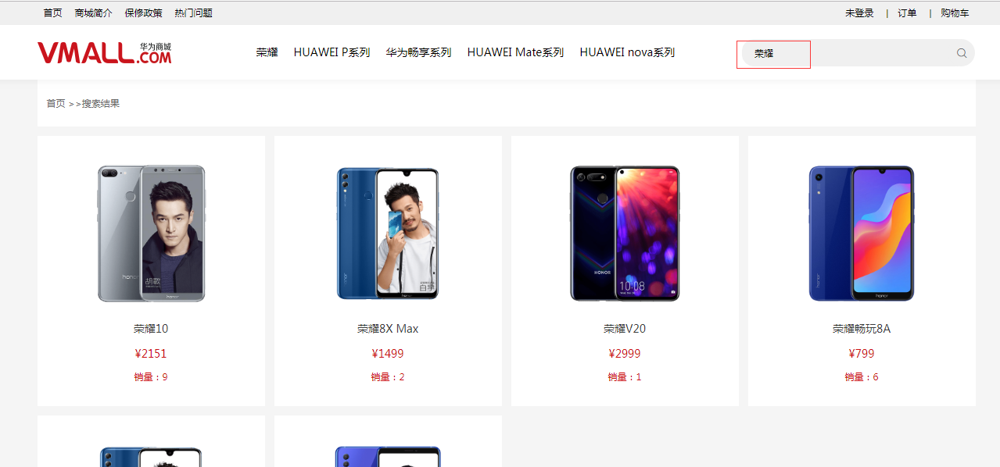
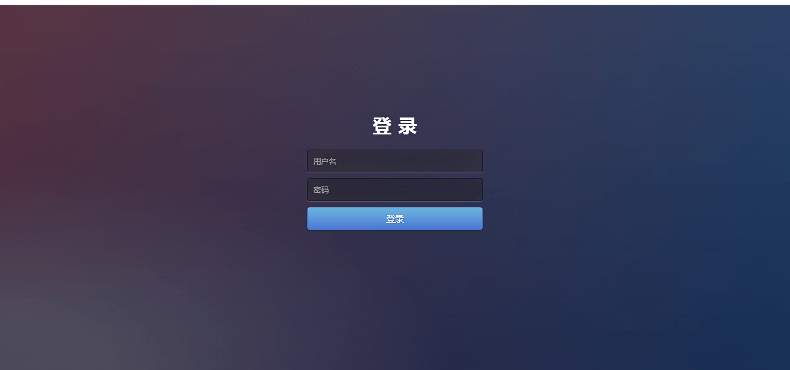

# PHP-Apache-MySQL-PHP-Vue-jq
> 前端仿华为商城布局，带后台管理，后端php，前端vue+jq+html+css+elementui

1. 后台需要php环境，参考（图文）最详细的XAMPP的安装及使用教程[可参考](https://blog.csdn.net/qq_36595013/article/details/80373597)

2. 客户端主要实现了：手机列表展示、手机产品详情、库存、积分、销量排序，搜索、登录注册、修改个人信息、配置收货地址、购物车功能、生成订单、用户评价、，
后台管理系统主要实现了：对手机产品的添加、修改、删除。公告管理、订单管理、用户管理、管理员、
3. 后台实现了：对数据的增删改查，多表关联、图片上传

#### 系统前台 - 首页

#### 系统前台 - 搜索

#### 系统前台 - 大致功能演示

#### 系统后台 - 大致功能演示

